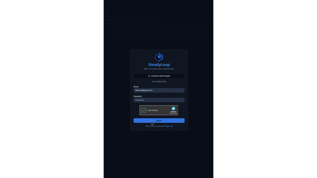

  
  <h1>SteadyLoop ♾️</h1>
  

    <b>"A Flight Recorder for the Bipolar Brain."</b>
  

**SteadyLoop** is a **clinically-aligned**, privacy-first Progressive Web App (PWA) engineered specifically for **tracking stability** in Bipolar Type 1 & 2. It prioritizes **latency, data integrity, and zero-friction logging** over social features or gamification.

## 💡 The Philosophy (Zero Friction)

Most mental health applications suffer from "feature bloat." SteadyLoop was built to solve a specific **UX Latency Problem**:
The goal is to engineer a system that captures critical health data in **under 5 seconds**, ensuring adherence even in high-stress, mixed-state scenarios.

## ⚡ Core Architecture

### **1. The Clinical Scale**
Refactored from arbitrary "star ratings" to SteadyLoop implements a **Integer Scale** mapped directly to standard reporting metrics for Depression, Stability, and Mania. This ensures data is instantly readable by care providers.

### **2. Velocity Visualization**
Raw data is processed into a **7-Day Trend Line**. The system analyzes entry velocity to visually highlight shifts away from baseline, aiding in personal pattern recognition.

### **3. The Smart Cabinet**
A dynamic medication inventory system handling complex dosing schedules.
* **The Tech:** Implements advanced **Latency Management** patterns to provide instant feedback on user interactions, decoupling UI responsiveness from network connection.
* **The Safety:** Includes safeguard logic to prevent database pollution from accidental logs.

### **4. Native PWA**
Configured for a strictly native feel. The application installs to the home screen with **standalone** display mode, leveraging Service Workers for offline-first resilience.

### **5. The Nuclear Option (Data Sovereignty)**
Privacy is a core tenet. A **Cascade Delete** feature allows the user to wipe their entire existence (Auth User + Database Rows) instantly. No soft deletes. No retention buckets.

## 🛠️ The Tech Stack

Built for reliability and speed on the Vercel Edge Network.

| Layer | Technology |
| :--- | :--- |
| **Framework** | **Next.js 16** (App Router, Server Actions) |
| **Database** | **Supabase** (PostgreSQL + RLS) |
| **Validation** | **Zod** (Strict runtime schema validation) |
| **Styling** | **Tailwind CSS** + Shadcn UI (Dark Mode Default) |
| **Visualization** | **Recharts**|
| **Deployment** | **Vercel** (CI/CD Pipeline) |

**Key Engineering Features:**
* **Zero-API Architecture:** Direct, type-safe database mutations via Server Actions, removing the latency of traditional REST API layers.
* **Global Timezone Resilience:** Custom client-side aggregation logic ensures data consistency across travel and timezones, preventing server-side date drift.
* **Database-Level Isolation:** Strict Row Level Security (RLS) policies enforce total data sovereignty at the database engine level, ensuring users can never access rows they do not own.

## 🔒 License & IP

**SteadyLoop is Proprietary Software.**

* **The Code:** The source code is hosted in a private repository to protect the intellectual property and safety logic.
* **The Purpose:** This public repository serves as the **Documentation, Issue Tracker, and Roadmap** for the community.

**Disclaimer:** SteadyLoop is a data logging tool, not a medical device. It does not provide medical advice, diagnosis, or treatment. Always seek the advice of your physician or other qualified health provider.

## 🚀 Roadmap & Future Features
**Current Status:** `v1.0 (Closed Beta)`

**Phase 2 (In Development):**
* [ ] **Clinical Reporting:** Standardized PDF/CSV generation for care provider review.
* [ ] **Active Welfare Protocols:** Automated crisis intervention logic (The "Dead Man's Switch").
* [ ] **Biometric Session Management:** WebAuthn integration for secure, low-friction access.

---

### 👨‍💻 Author

**Timothy Finomo**
Lead Engineer, SteadyLoop.
*Building quiet tools for loud minds.*
* **Copyright:** © 2025 Timothy Finomo. All Rights Reserved.

## 📸 The "Quiet" UI System

### 🎥 Interaction Preview

### ☀️ Light Mode
| **Dashboard View** | **History List** |
| :---: | :---: |
|  |  |
| **Settings** | **Trends Analysis** |
|  |  |

### 🌙 Dark Mode (Default)
| **Dashboard View** | **History List** |
| :---: | :---: |
|  |  |
| **Settings** | **Login Page** |
|  |  |
